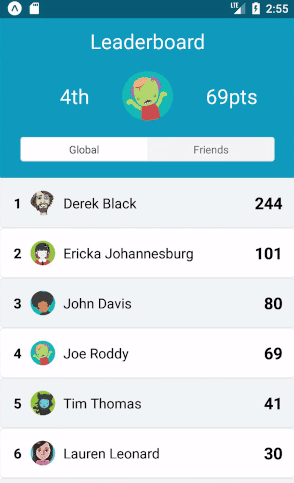

# react-native-leaderboard
Simple and configurable leaderboard component for react native



### Up and Running

```shell
$ npm install --save react-native-leaderboard
```

### Simple Example

```javascript
//...
import Leaderboard from 'react-native-leaderboard';
//...
this.state = {
    data: [
        {userName: 'Joe', highScore: 52},
        {userName: 'Jenny', highScore: 120},
        //...
    ] //can also be an object of objects!: data: {a:{}, b:{}}
}

render() {
  return (
      <Leaderboard 
        data={this.state.data} 
        sortBy='highScore' 
        labelBy='userName'/>)
}
```

### Props
| Prop | Type | Required | Description |
| :------------ |:---------------:|:------:| :-----|
| data | array or object|yes| Object array or object of objects |
| sortBy | string |yes| Data property that should be sorted and displayed
| labelBy | string|yes | Data property that should be displayed to identify user |
| icon | string |no| Data property that stores the avatar's URL |
| onRowPress | function |no| Called when a row is clicked. Arguments: item, index |
| sort | function |no| Override the default sort behavior. Arguments: data |
| renderItem | function |no| Override the default row. Arguments: item, index |
| containerStyle | object |no| Style for the outer container (RN.View) |
| rankStyle | object |no| Style for the displayed rank (RN.Text) |
| labelStyle | object |no| Style for the displayed name (RN.Text)|
| scoreStyle | object |no| Style for displayed score (RN.Text) |
| avatarStyle | object |no| Style for user images (RN.Image) |
| oddRowColor | string |no| Background color for odd rows |
| evenRowColor | string |no| Background color for even rows |
